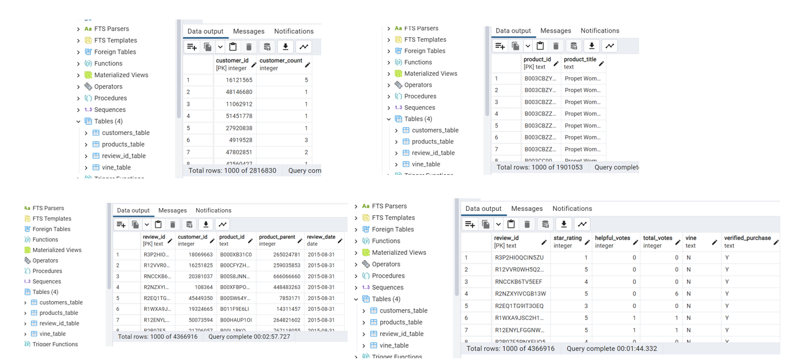
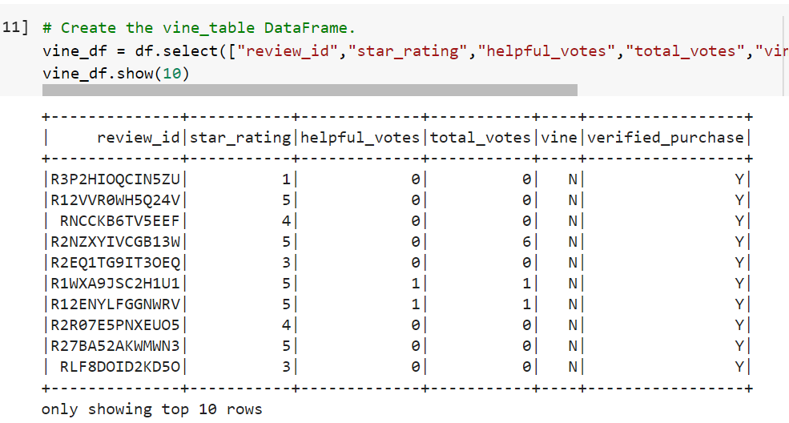
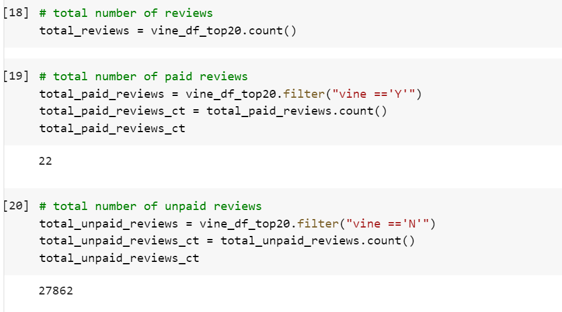
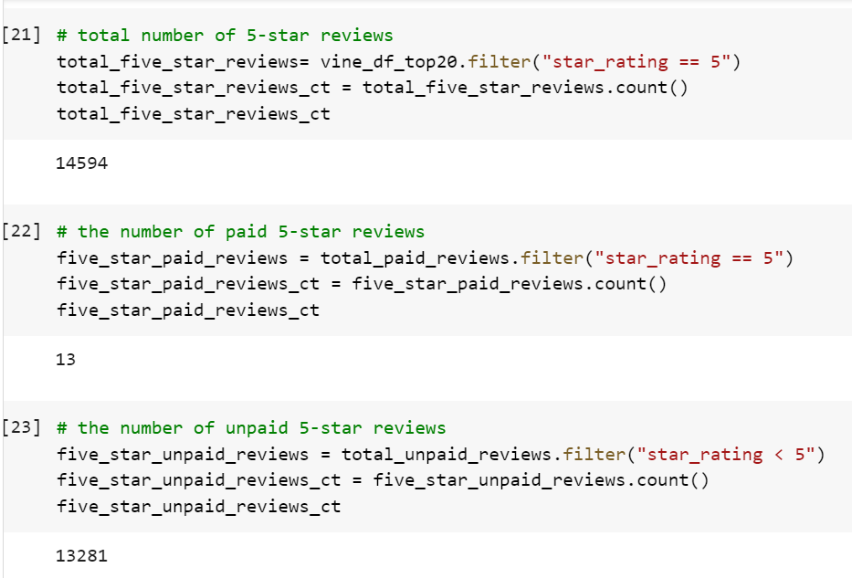

# Amazon_Vine_Analysis

## Overview of Analysis
Analyzing the reviews written by paid Vine program vs. non-paid reviewers to see if there is any bias based on the Vine program. Using Amazon shoe data for analysis.

## Results

Using RDS we created 4 tables from the Amazon shoe data, the customers_table, products_table, review_id_table, and vine_table. 

The main portion of the analysis focused on the vine_table data. 

### How many Vine reviews and non-Vine reviews were there?
In this data there were only 22 paid reviews and 27862 unpaid reviews. 

### How many Vine reviews were 5 stars? How many non-Vine reviews were 5 stars?
There were 14,594 total 5 star reviews, 13 of which were vine reviews and 13,281 were not paid (non-vine). 

### What percentage of Vine reviews were 5 stars? What percentage of non-Vine reviews were 5 stars?
59% of the Vine reviews were 5-star reviews, 48% of the non-Vine reviews were 5-star reviews.
![](reviews_5star_paid_unpaid_percentages.png

## Summary
